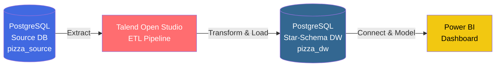
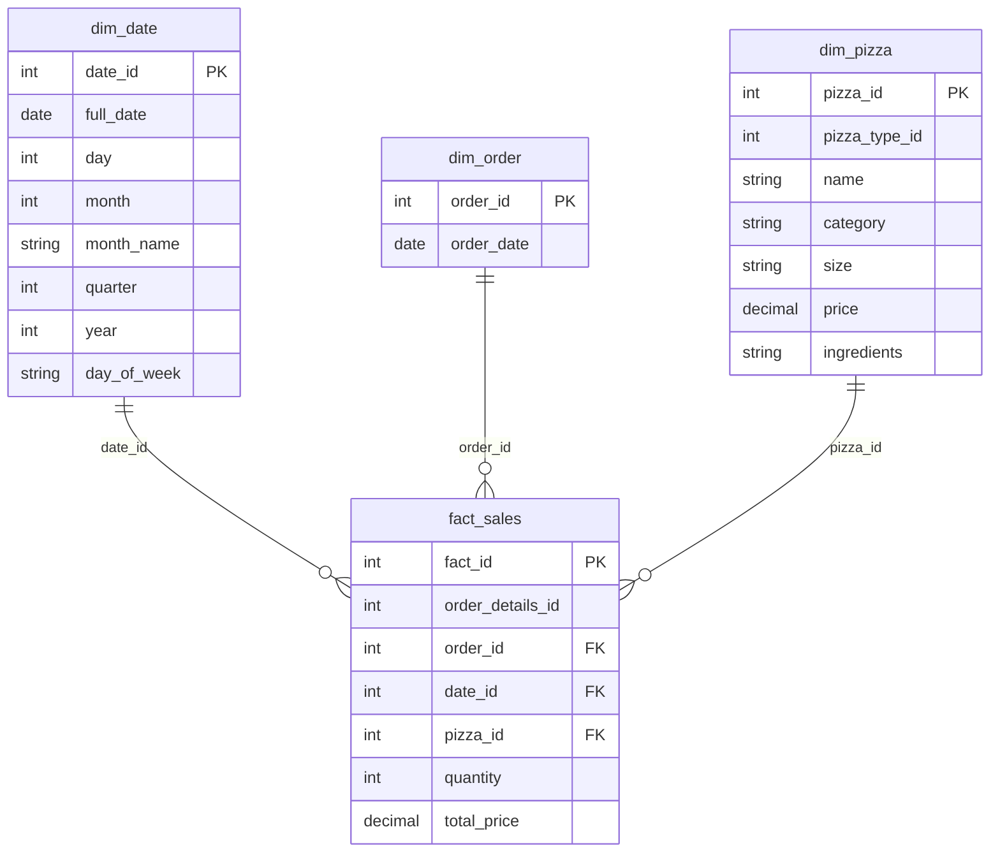
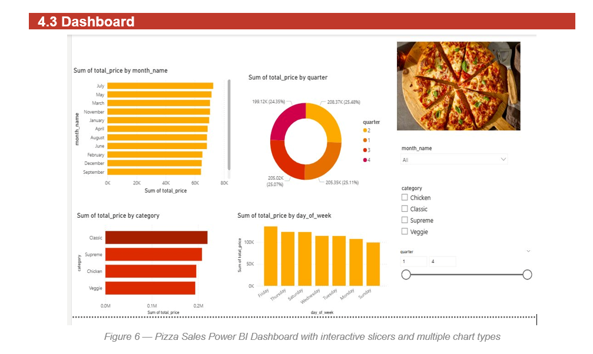

# Pizza Sales BI Pipeline

End-to-end Business Intelligence pipeline transforming transactional pizza sales data into a Power BI dashboard, built on a PostgreSQL star-schema data warehouse with an automated Talend ETL layer.

<p>
  
  
  
  
</p>

---

## Documentation & Reports

📄 **[View Full Project Report (PDF)](database/PizzaSales_BI_Project.pdf)**

---

## Business Problem

The restaurant recorded 2015 transactional data across flat operational tables without an analytical framework to evaluate sales trends, peak ordering hours, or category revenue distribution. This project establishes an end-to-end data pipeline: modeling a star-schema data warehouse, automating ETL execution, and deploying a reporting dashboard.

---

## Architecture



| Component | Technology | Purpose |
|---|---|---|
| **Source DB** | PostgreSQL 16 | Operational database hosting raw transactional records |
| **ETL Layer** | Talend Open Studio | 4 automated jobs for data cleaning, mapping, and loading |
| **Data Warehouse** | PostgreSQL | Star-schema repository optimized for analytical queries |
| **Analytics Layer** | Power BI Desktop | Direct connectivity for DAX calculations and executive dashboards |

---

## Dataset Overview

Source dataset contains 48,620 transactional order records from 2015.

| File | Records | Key Columns | Description |
|---|---|---|---|
| `orders.csv` | 21,350 | `order_id`, `date`, `time` | Timestamped order placements |
| `order_details.csv` | 48,620 | `order_details_id`, `order_id`, `pizza_id`, `quantity` | Itemized order details |
| `pizzas.csv` | 96 | `pizza_id`, `pizza_type_id`, `size`, `price` | Pizza size variants and pricing |
| `pizza_types.csv` | 32 | `pizza_type_id`, `name`, `category`, `ingredients` | Pizza category metadata |

---

## Data Warehouse Model

Star-schema configuration optimized for analytical querying, featuring a central fact table and three dimensional tables.



| Table | Type | Primary Key | Foreign Keys |
|---|---|---|---|
| `fact_sales` | Fact | `fact_id` | `order_id`, `date_id`, `pizza_id` |
| `dim_date` | Dimension | `date_id` | N/A |
| `dim_order` | Dimension | `order_id` | N/A |
| `dim_pizza` | Dimension | `pizza_id` | N/A |

---

## ETL Pipeline Summary

Implemented using four dedicated Talend Open Studio jobs:

| Job | Description | Source → Target | Rows Loaded |
|---|---|---|---|
| `Load_DIM_DATE` | Extracts distinct dates and derives `day`, `month`, `quarter`, `year`, and `day_of_week` | `pizza_source` → `dim_date` | 358 |
| `Load_DIM_ORDER` | Normalizes order records and dates | `pizza_source` → `dim_order` | 21,350 |
| `Load_DIM_PIZZA` | Merges pizza variants with category metadata | `pizza_source` → `dim_pizza` | 96 |
| `Load_FACT_SALES` | Performs lookup joins against dimensions and calculates `total_price = quantity * price` | `pizza_source` + `pizza_dw` → `fact_sales` | 48,620 |

---

## Core Analytics & DAX Measures

```dax
Total Revenue = SUM(fact_sales[total_price])

Total Orders = DISTINCTCOUNT(fact_sales[order_id])

Total Quantity = SUM(fact_sales[quantity])

Avg Order Value = DIVIDE([Total Revenue], [Total Orders])
```

---

## Dashboard Preview



---

## Key Findings

* **Seasonality:** Revenue peaks in May and July, with drops in September and October.
* **Quarterly Distribution:** Quarterly revenue remains relatively balanced (~25% per quarter), leading slightly in Q1 and Q2.
* **Category Performance:** Classic category pizzas drive the highest overall revenue, followed by Supreme, Chicken, and Veggie categories.
* **Day of Week:** Friday generates the highest sales volume, followed by Thursday and Wednesday. Sunday records the lowest volume.

---

## Business Recommendations

* **Address Slow Periods:** Schedule promotions during September and October to balance annual cash flow.
* **Capitalize on Peak Demand:** Align inventory management and staffing with high-volume periods on Thursday and Friday evenings.
* **Optimize Menu Matrix:** Expand high-performing Classic pizza offerings while evaluating low-margin menu items.
* **Drive Weekend Traffic:** Introduce Sunday-specific bundle deals to boost lower baseline revenue.

---

## Tools Used

| Tool | Purpose |
|---|---|
| PostgreSQL 16 | Relational operational database and star-schema warehouse |
| Talend Open Studio | ETL processing and data loading |
| Power BI Desktop | Analytics modeling and interactive reporting |

---

## Authors

Academic project developed for the Business Intelligence curriculum at **Esprit School of Business (ESB)**.

* **Raed Meddeb:** Data Warehouse Architecture & ETL Pipeline Development
* **Wajdi Riahi:** Data Warehouse Schema Design
* **Noureddine Chehimi:** Power BI Dashboard & DAX Implementation

*Supervised by Mrs. Dalila Amara.*
