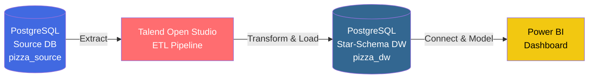

# Pizza Sales BI Pipeline

> End-to-end Business Intelligence pipeline transforming raw transactional pizza sales data into an interactive, decision-ready Power BI dashboard — built on a PostgreSQL star-schema data warehouse with a fully automated Talend ETL layer.

<p>
  
  
  
  
</p>

---

## Documentation & Reports

📄 **[Click here to view the Full Project Report (PDF)](database/PizzaSales_BI_Project.pdf)**

---

## Business Problem

> **How can a pizza restaurant optimize its sales strategy by analyzing ordering patterns across time, pizza types, and order behavior to maximize revenue and improve business decisions?**

The restaurant had a full year (2015) of raw transactional data sitting in an operational database with no analytical layer on top of it — no trends, no seasonality, no category-level view of what was actually driving revenue. This project builds that layer from scratch: a proper data warehouse, an automated pipeline to keep it populated, and a dashboard that turns the numbers into decisions.

---

## Architecture



**Flow:** `Source DB → Talend ETL → Data Warehouse → Power BI`

| Stage | Tool | Role |
|---|---|---|
| Source Database | PostgreSQL 16 + PgAdmin 4 | Hosts the 4 raw operational tables imported from CSV |
| ETL | Talend Open Studio | Extracts, transforms, and loads data into the warehouse via 4 automated jobs |
| Data Warehouse | PostgreSQL (star schema) | Hosts `fact_sales` and 3 conformed dimensions |
| Visualization | Power BI Desktop | Connects directly to the warehouse; DAX measures + interactive dashboard |

---

## Dataset Overview

Source: **Pizza Place Sales** — a real pizza restaurant's full year of transactional data (2015), **48,620 order-detail records**.

| File | Records | Key Columns | Role |
|---|---|---|---|
| `orders.csv` | 21,350 | `order_id`, `date`, `time` | When orders were placed |
| `order_details.csv` | 48,620 | `order_details_id`, `order_id`, `pizza_id`, `quantity` | What was ordered |
| `pizzas.csv` | 96 | `pizza_id`, `pizza_type_id`, `size`, `price` | Pizza variants and prices |
| `pizza_types.csv` | 32 | `pizza_type_id`, `name`, `category`, `ingredients` | Pizza types and categories |

---

## Star Schema Model

One central fact table surrounded by three dimensions, with special attention given to the **Date** dimension.

```mermaid
erDiagram
    dim_date ||--o{ fact_sales : "date_id"
    dim_order ||--o{ fact_sales : "order_id"
    dim_pizza ||--o{ fact_sales : "pizza_id"

    fact_sales {
        int fact_id PK
        int order_details_id
        int order_id FK
        int date_id FK
        int pizza_id FK
        int quantity
        decimal total_price
    }
    dim_date {
        int date_id PK
        date full_date
        int day
        int month
        string month_name
        int quarter
        int year
        string day_of_week
    }
    dim_order {
        int order_id PK
        date order_date
    }
    dim_pizza {
        int pizza_id PK
        int pizza_type_id
        string name
        string category
        string size
        decimal price
        string ingredients
    }
