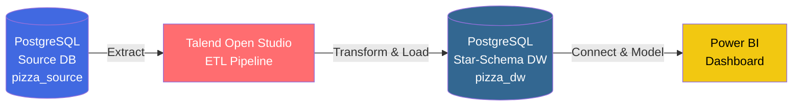
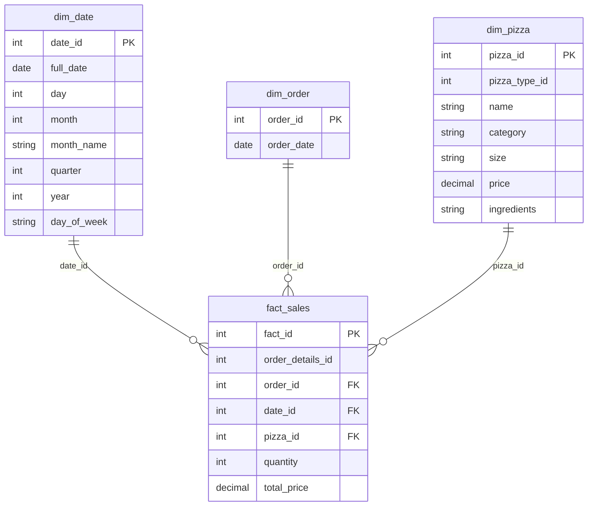

#  Pizza Sales BI Pipeline

> End-to-end Business Intelligence pipeline transforming raw transactional pizza sales data into an interactive, decision-ready Power BI dashboard — built on a PostgreSQL star-schema data warehouse with a fully automated Talend ETL layer.

<p>
  
  
  
  
</p>

---

##  Business Problem

> **How can a pizza restaurant optimize its sales strategy by analyzing ordering patterns across time, pizza types, and order behavior to maximize revenue and improve business decisions?**

The restaurant had a full year (2015) of raw transactional data sitting in an operational database with no analytical layer on top of it — no trends, no seasonality, no category-level view of what was actually driving revenue. This project builds that layer from scratch: a proper data warehouse, an automated pipeline to keep it populated, and a dashboard that turns the numbers into decisions.

---

##  Architecture



**Flow:** `Source DB → Talend ETL → Data Warehouse → Power BI`

| Stage | Tool | Role |
|---|---|---|
| Source Database | PostgreSQL 16 + PgAdmin 4 | Hosts the 4 raw operational tables imported from CSV |
| ETL | Talend Open Studio | Extracts, transforms, and loads data into the warehouse via 4 automated jobs |
| Data Warehouse | PostgreSQL (star schema) | Hosts `fact_sales` and 3 conformed dimensions |
| Visualization | Power BI Desktop | Connects directly to the warehouse; DAX measures + interactive dashboard |

---

##  Dataset Overview

Source: **Pizza Place Sales** — a real pizza restaurant's full year of transactional data (2015), **48,620 order-detail records**.

| File | Records | Key Columns | Role |
|---|---|---|---|
| `orders.csv` | 21,350 | `order_id`, `date`, `time` | When orders were placed |
| `order_details.csv` | 48,620 | `order_details_id`, `order_id`, `pizza_id`, `quantity` | What was ordered |
| `pizzas.csv` | 96 | `pizza_id`, `pizza_type_id`, `size`, `price` | Pizza variants and prices |
| `pizza_types.csv` | 32 | `pizza_type_id`, `name`, `category`, `ingredients` | Pizza types and categories |

---

##  Star Schema Model

One central fact table surrounded by three dimensions, with special attention given to the **Date** dimension.



| Table | Type | Key Columns |
|---|---|---|
| `fact_sales` | Fact | `fact_id` (PK), `order_details_id`, `order_id` (FK), `date_id` (FK), `pizza_id` (FK), `quantity`, `total_price` |
| `dim_date` | Dimension | `date_id` (PK), `full_date`, `day`, `month`, `month_name`, `quarter`, `year`, `day_of_week` |
| `dim_order` | Dimension | `order_id` (PK), `order_date` |
| `dim_pizza` | Dimension | `pizza_id` (PK), `pizza_type_id`, `name`, `category`, `size`, `price`, `ingredients` |

**Relationships:** `fact_sales.date_id → dim_date.date_id` · `fact_sales.order_id → dim_order.order_id` · `fact_sales.pizza_id → dim_pizza.pizza_id` (all Many-to-One)

---

##  ETL Pipeline — Talend Open Studio

Four fully automated jobs, one per dimension plus the fact table:

| Job | Description | Source → Target | Rows Loaded |
|---|---|---|---|
| `Load_DIM_DATE` | Extracts distinct dates; derives `day`/`month`/`quarter`/`year`/`day_of_week` via `TalendDate.formatDate()` | `pizza_source` → `dim_date` | 358 |
| `Load_DIM_ORDER` | Loads all orders with their order dates | `pizza_source` → `dim_order` | 21,350 |
| `Load_DIM_PIZZA` | Joins `pizzas` and `pizza_types` source tables into one unified pizza dimension | `pizza_source` → `dim_pizza` | 96 |
| `Load_FACT_SALES` | Main fact job — 3 lookup joins (date via `full_date`, pizza via `pizza_id`, order via `order_id`); calculates `total_price = quantity × price` | `pizza_source` + `pizza_dw` → `fact_sales` | 48,620 |

**Key `tMap` transformations:**
- `DIM_DATE` — derives all calendar attributes from a single date field
- `DIM_PIZZA` — joins `pizzas` + `pizza_types` into a unified dimension
- `FACT_SALES` — three inner joins plus the `total_price` calculation

---

##  Power BI Dashboard & DAX Measures

Power BI Desktop connects directly to `pizza_dw`, with relationships configured in Model view (`fact_sales` → each dimension, Many-to-One).

| Measure | DAX Formula |
|---|---|
| Total Revenue | `SUM(fact_sales[total_price])` |
| Total Orders | `DISTINCTCOUNT(fact_sales[order_id])` |
| Total Quantity | `SUM(fact_sales[quantity])` |
| Avg Order Value | `DIVIDE([Total Revenue], [Total Orders])` |

**Dashboard views:**
- Revenue by Month (bar chart)
- Revenue by Quarter (donut chart)
- Revenue by Category (bar chart)
- Revenue by Day of Week (bar chart)
- Interactive slicers: `month_name`, `category`, `quarter`
- ## Dashboard Preview


---

##  Key Findings

| Dimension | Finding |
|---|---|
| **Seasonality** | July and May are peak revenue months; September and October are the weakest — a clear summer demand pattern |
| **Quarterly trend** | Revenue is fairly evenly split across quarters (~25% each), with Q1/Q2 slightly ahead — consistent year-round demand |
| **Category** | **Classic** pizzas generate the most revenue, followed by Supreme, Chicken, then Veggie |
| **Day of week** | **Friday** is the busiest day by far, followed by Thursday and Wednesday; **Sunday** is the slowest |

##  Business Recommendations

- **Boost slow months** — targeted marketing/promotions in September–October to counter the seasonal dip
- **Capitalize on peak days** — focus promotional pushes on Thursday/Friday when volume is already highest
- **Double down on Classic** — expand the Classic category given it's the clear top revenue driver
- **Revive Sundays** — introduce Sunday-specific offers to lift the weakest day of the week

---

##  Repository Structure

```
pizza-sales-bi-pipeline/
├── database/
│   ├── source_schema.sql          # pizza_source table definitions
│   ├── dw_schema.sql              # pizza_dw star schema (fact + dimensions)
│   └── sample_data/               # raw CSV files (orders, order_details, pizzas, pizza_types)
├── etl/
│   ├── Load_DIM_DATE.item         # Talend job
│   ├── Load_DIM_ORDER.item        # Talend job
│   ├── Load_DIM_PIZZA.item        # Talend job
│   ├── Load_FACT_SALES.item       # Talend job
│   └── job_execution_logs/        # run logs / screenshots
├── dashboards/
│   └── PizzaSales_Dashboard.pbix  # Power BI report file
├── docs/
│   ├── star_schema_diagram.png
│   ├── architecture_diagram.png
│   └── PizzaSales_BI_Report.pdf   # full project write-up
└── README.md
```

---

##  Tools Used

| Tool | Version | Purpose |
|---|---|---|
| PostgreSQL + PgAdmin 4 | PostgreSQL 16 | Source database and data warehouse hosting |
| Talend Open Studio | Data Integration | ETL — Extract, Transform, Load |
| Power BI Desktop | Microsoft Power BI | Data visualization and dashboard creation |

---

##  Authors

Built for the Business Intelligence course at **Esprit School of Business (ESB)** — Academic Year 2025–2026.

- **Raed Meddeb** —  & ETL (Talend, PostgreSQL)
- Wajdi Riahi Database design (star schema)
- Noureddine Chehimi Power Bi Data Visualization

*Supervised by Mrs. Dalila Amara.*
